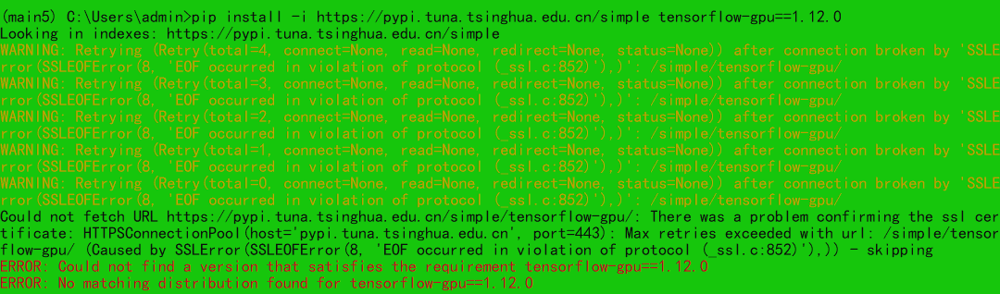
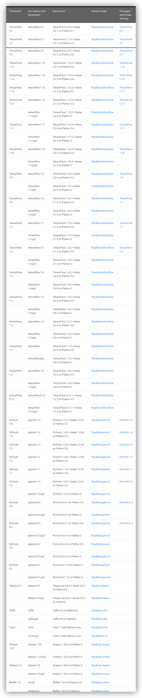
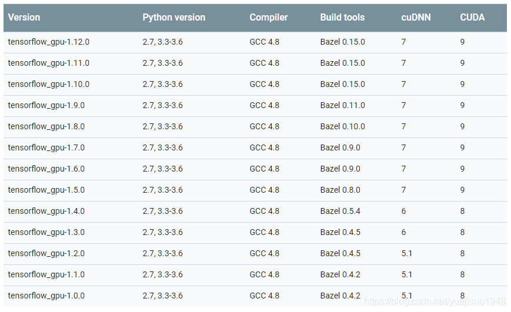
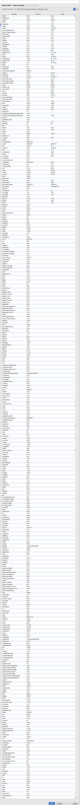

1.创建虚拟环境
	• conda create -n your_env_name python=X.X
2.更新conda（慎用！！！，新conda可能用不了）
	• conda updata conda
3.查看虚拟环境菜单和环境内已载入库
	• conda env list/conda info -e
	• conda list
<!--more-->
4.激活虚拟环境
	• Conda activate your_env_name
5.前人配置好的版本
	• Keras==2.2.4
	• Tensorflow-gpu==1.12.0
6.如果遇到conda安装频繁报错，使用如下语句：
	• conda clean -i
7.如果不幸要删除虚拟环境
	• conda remove -n your_env_name --all
8.如果pip安装报错如下，可以检查一下是不是翻墙了

9.镜像pip
	• pip install -i https://pypi.tuna.tsinghua.edu.cn/simple opencv-python
	• pip install -i https://pypi.douban.com/simple opencv-python
	
10.大电脑虚拟环境记录：
	• Main5：keras开发框架
	• labelme：用于打开labelme工具
	• torch：Torch开发框架

⚠️tensorflow、keras、python对应版本关系：

⚠️Tensorflow、CUDA、python、cudnn版本关系：

⚠️前人配置环境全赏:

