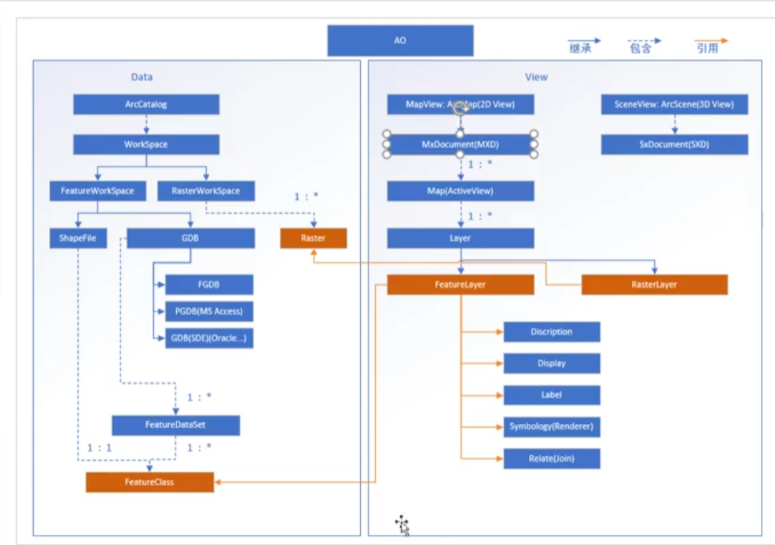

1.ESRI出版的《Modeling Our World》讲解了成熟的GIS思想方法
2.GIS相比传统制图工具：
	• 制图工具只能在不同维度制作可视的现实还原，无法展开空间分析。GIS相当于传统制图的下一发展阶段，为整个世界创造了空间分析的可视化制图方法。值得一提的是，以CAD为代表的传统制图和GIS齐头并进，各有千秋，应当进一步融合。
<!--more-->
3.分层概念：
	• Feature In FeatureClass：一座城市有许多独立的、多种类的水厂，整个城市的各种水厂形成单独的群体。这就像当于面向对象中抽象的概念，各种feature继承了featureClass基类，但是feature和featureClass在GIS中都是作为独立一层存储的。
4.抽象简化：
	• 空间抽象：现实信息组织入虚拟一般有抽象简化的过程，空间万物都是立体的，但是可以抽象成点线面存储在GIS中。
	• 属性抽象：就像猫狗都是生物但是不同种类一般，不同的空间要素不能在同一图层，因为字段组织不一致。但是他们抽象出来的特征可能一致，即可能属于同一图层。
