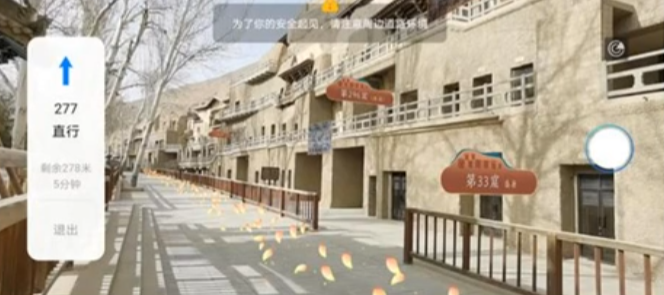
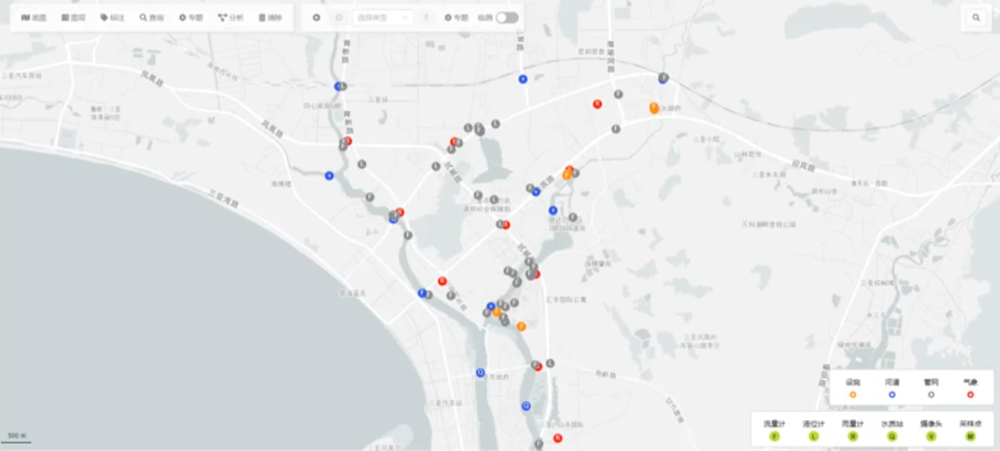

1.总体来说GIS发展遇到了瓶颈
	• 烂概念+旧瓶装新酒：
		○ 数字城市
		○ 智慧城市
		○ 城市大脑
		○ CIM=BIM+GIS
		○ 云GIS
		○ 大数据城市
		○ ……
	• 大部分概念可能有一些有趣的东西，但是都不足以成为技术革命。这些名词多少有点商业包装的成分，也侧面表明了GIS产业的瓶颈。
<!--more-->
2.GIS+VR/AR
	• 室内导航、实景导航等如华为AR地图——河图的简单运用
	
	
3.一个研究生非常适合研究（通过）的选题：GIS+物联网+行业模型（机理模型）
	• 物联网实现不难，行业模型大部分数据来源就可以利用物联网，成为数据来源；行业模型开放输入，作为静态模型存在；GIS提供背后的空间数据分析能力，最终输出时间序列或者空间序列的展示。
	
4.GIS+大数据分析（统计学模型，和人工智能无关）
	• 手机信令，北京第二次疫情病例行迹排查
5.GIS+机器学习（非机理）
	• GIS科班的学生对人工智能的认识基本很模糊，机器学习的神经网络是人工智能最典型的。可以理解神经网络过程是  黑箱>>灰箱>>白箱  的过程。黑箱：未知模型>>灰箱：神经网络训练>>白箱：机理模型——可表达模型（如水动力模型数学公式）。研究这方面，训练数据和空间分析挂钩是最好，不然GIS存在感太弱。
6.RS+深度学习（非机理）
	• 遥感影像解译+卷机神经网络（CNN）是天生的一对
	• 栅格计算+图像识别
7.GIS+BIM
	• 其实就是CIM平台开发，目前来讲做BIM的华而不实，自然CIM就是为了突破BIM的硬实力羸弱局面，但是很难，目前对于学生而言基本不现实，对于游戏开发或者大型地信企业是有用的。
8.GIS自身技术突破
	• 图形学
	• 三维切片（cesium），点云
	• 时空GIS（停留在概念阶段）
	
