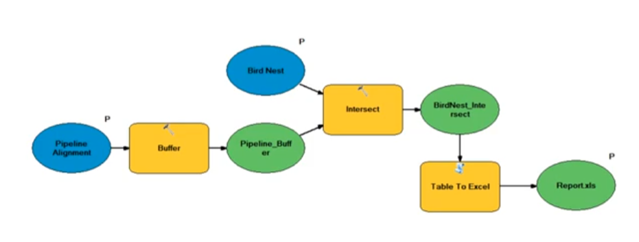

1.输入（蓝）、处理（橙）、输出（绿）：
	• 输入处理输出是最基本最简化的应用逻辑
<!--more-->
	
2.GIS模型+具体行业模型（集成）
	• 举例复杂应用：水务行业的排水管网SWMM模型（排水管网属于GIS模型，SWMM属于税务行业模型）
		○ 对应GISer的思想：
			§ 给排水管建模
			§ 分层：根据用户需求分析得到的设备类型抽象图层：检查井、管线、汇水区……
			§ 抽象：
				□ 检查井，点类型：坐标、高程……
				□ 管线，线类型：上下游井、埋深、管长、管径……
				□ 汇水区，面类型：面积……
		○ 针对思想的复杂应用构建：
			§ 输入：
				□ 检查井：坐标、高程……<<DEM高程提取
				□ 管线：上下游井、埋深、管长、管径……<<上下游网络拓扑
				□ 汇水区：面积……<<小流域Basin划分工具
			§ 处理：
				□ SWMM模型引擎（和GIS关系不大，主要来源于行业模型）
			§ 输出（行业用户对应需求）：
				□ 检查井的水位变化序列的动态专题渲染
				□ 管线流量、充满度变化序列的动态专题渲染
