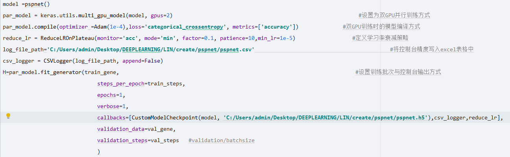

在一切开始前，请确定计算机拥有英伟达的显卡。
（不是英特尔！不是英特尔！不是英特尔！）
<!--more-->
1.版本号：
	• keras==2.2.4
	• Tensorflow-gpu==1.12.0
	• CUDA==9.0.176
	• cuDNN==7.6.5 for CUDA 9.0
	• Scikit-image
	• Opencv-python
2.CUDA下载
• 从 https://developer.nvidia.com/cuda-toolkit-archive 中打开下载中心，找到相应版本，点击版本号即可进入下载页面

• 选择要下载的平台、版本号等，点击DOWNLOAD即可

3.cuDNN下载·安装
• 首先，把CUDA安装好，从 NVIDIA cuDNN | NVIDIA Developer https://developer.nvidia.com/zh-cn/cudnn 
中打开cuDNN中心，点击“下载cuDNN”，登录之后填写问卷即可下载。最后bin、include、lib三个文件夹里的文件复制到CUDA的对应文件夹中就行了。

4.单gpu训练/多gpu训练
• 单gpu非常简单，只需要写图中语句即可用keras实现单gpu训练

• 多gpu需要用到muti函数生成模型，代码如下

5.找不到第二条gpu
• 有时候keras识别不了电脑的第二条gpu，执行muti会报错如下：

• 我这次是因为执行了这个语句造成的，这个语句只能供单gpu的model使用

