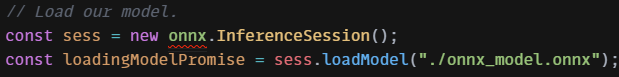

1.API接口，主要是通过中间商，为目标端暴露功能函数作为输入、处理、输出的桥梁。
<!--more-->
2.WEB预测API开发（基于ONNX）
• ONNX是用于机器学习模型云端发布的文件格式，是适用于不同框架的规范工具，
参考视频：How to run PyTorch models in the browser with ONNX.js - YouTube 
https://www.youtube.com/watch?v=Vs730jsRgO8
项目地址：pytorch-to-javascript-with-onnx - CodeSandbox 
https://codesandbox.io/s/vgzep?file=/index.html

• 训练并保存model.state_dict()
    ○ ONNX支持pt格式的模型介绍文件（model.state_dict()），训练时输入以下语句保存，也可以是pth格式
    
    ○ 注意搭建模型的时候检查激活函数是否支持ONNX，查询相关文档：
    https://github.com/microsoft/onnxjs/blob/v0.1.8/docs/operators.md
    切换激活函数后还要更换对应的损失函数算法，比如softmax对应nn.functional.cross_entropy()
    ○ 另外，ONNX仅支持单GPU训练的model，切勿使用DataParellel等model。
    ○ 可以根据网络模型的github官网复制代码，搭建网络的时候要告知前端输入的图片尺寸，比如画布要绘制高清图可以预设网络输入尺寸为(280,280,4)，后期在池化层池化十倍即可。若onnx不能起作用，检查网络的pytorch语句是否有bug（如池化时不能对图片切片而必须使用torch.narrow(x)），可以查看pytorch官网文档或者中文文档的解释：
    https://pytorch.org/docs/stable/index.html or https://pytorch-cn.readthedocs.io/zh/latest/
    
• pt转onnx文件
    ○ 载入pt文件，切换为eval模式
    
    ○ 预先构造空的待测影像矩阵，并同相关参数传入torch.onnx.export()，导出onnx文件
    

• 前端对ONNX文件的获取和操作/API接口搭建
    ○ 首先，必须输入图中语句调用ONNX服务
    
    ○ 训练后生成的ONNX文件直接部署到前端项目文件夹，ONNX提供如下js操作以执行预测：
        § 新建Session，并在Session中载入model
        
        § 获取服务器待预测图片，传入Tensor
        
        § 对图片执行预测
        
        § 获取model输出Tensor
        
        § 从输出Tensor提取出概率分布矩阵
        
        § 提取概率最大对应的分类结果（转化为分类结果）
        
    ○ 每次后端准备搭建API，以上都需要后端人员介绍给前端人员。

3.上面内容只是以分类任务为例子，👉 
https://github.com/microsoft/onnxjs/blob/v0.1.8/docs/api.md 有更多API搭建手段提供给分类、检测、分割等不同计算机视觉任务，关于遥感智能解译还要进一步探索。
