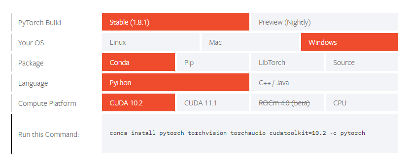

在一切开始前，请确定计算机拥有英伟达的显卡。
（不是英特尔！不是英特尔！不是英特尔！）
<!--more-->
CUDA安装参考该笔记：Keras·GPU训练（单/多）
1.依赖库版本：
	• Torch
	• Torchvision
2.安装PyTorch：
	• 进入PyTorch官网 Start Locally | PyTorch 选择版本，在conda运行所给安装语句
	
	• 然后参照Keras的gpu环境配置，安装CUDA11.1和对应的cudnn。
3.单gpu训练
	• 输入如下语句，指定搜索gpu的起始位置
	device=torch.device("cuda:0"iftorch.cuda.is_available()else"cpu")
4.多gpu训练
	• Torch.nn.DataParallel
		○ 输入如下语句，指定搜索gpu的起始位置
		device=torch.device("cuda:0"iftorch.cuda.is_available()else"cpu")
		○ 输入如下语句生成多gpu的model
			Par_model = nn.DataParallel(MyNet())
Par_model = Par_model.cuda(device)   #model加载到gpu
