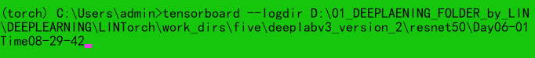
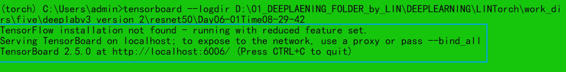
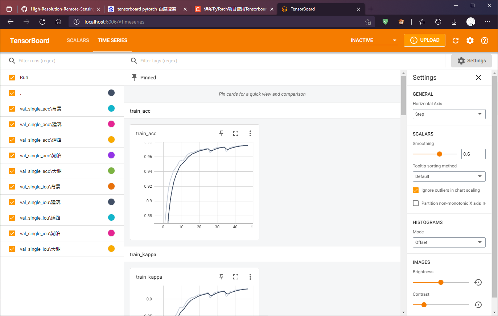
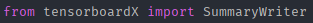
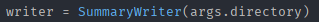
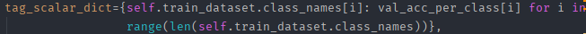
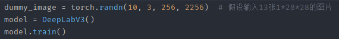
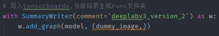
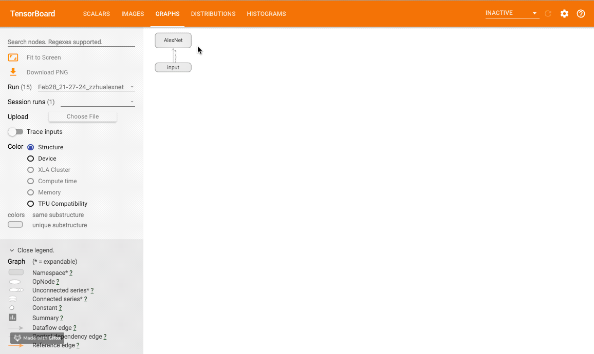

1.conda环境配置：
	• tensorboardX==2.2
	• Tensorboard==2.5.0
	• PyTorch==1.8.1
	• Torchvision==0.9.1
<!--more-->
2.查看记录
	• 首先学习以下tensorboardX怎么用。一般训练代码运行之后会同时生成tensorboardX的日志文件。这时复制日志文件所在文件夹路径，打开Anaconda命令行，切换环境至torch，输入图中语句为日志文件夹创建tensorboardX默认的本地端口（格式：tensorboard --logdir PATH）
	
	• 执行得到端口地址，复制到浏览器打开即可查看训练可视化内容
	
	
	• 关闭端口占用，只需长按CTRL + C
3.训练记录
	• 导入SummaryWriter
	
	• 在代码中初始化SummaryWriter实例，参数填记录的存储文件夹位置（有其他初始化方法，这里不常用）
	
	• 训练常用记录类型：
		○ （scalar）单个数值
			§ 参数：
				□ Tag：该数据名称（如train_acc），不同名称数据会用独立图表表示
				□ Scalar_value：数据值来源，一般是个python变量（如train_acc）
				□ Global_step：存放当前epoch值
				□ walltime：默认值time.time()，记录当下时间，一般填None不用
			§ 用法：如writer.add_scalar()
		○ （scalars）多个数值
		多个数值的记录类型利用python字典生成日志
			§ 参数：
				□ Main_tag：该图表总的名称
				□ Tag_scalar_dict：各类值的字典（如下）
	            
				□ Global_step：存放当前epoch值
				□ walltime：默认值time.time()，记录当下时间，一般填None不用
			§ 用法：如writer.add_scalars()
		○ （graph）网络结构/运行图
			§ 参数：
				□ model：待可视化的网络模型
				□ Input_to_model：输入的一组真图片或者伪造的零值图片
			§ 用法：
				□ 首先使用torch.randn(num,z,x,y)生成假数据，然后正常调用模型并切换至train状态
	            
				□ 然后使用with语句生成SummaryWriter实例并添加运行图
	            
				□ 当下文件夹目录会生成runs文件夹，这个文件路径为日志地址
	            
	• 其他记录类型：
	• 一些问题
		○ 如果执行 add 操作后没有实时在网页可视化界面看到效果，试试重启 tensorboard

