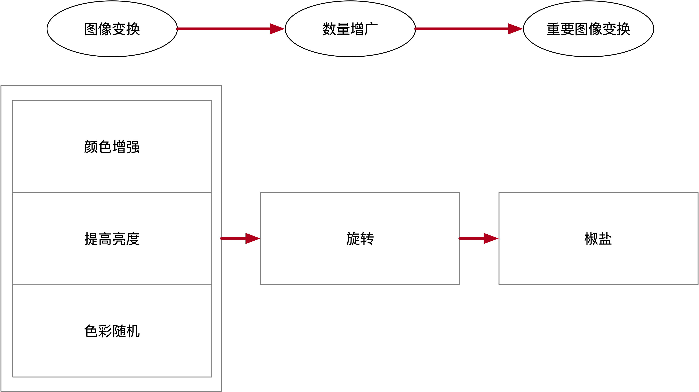

1.常用增广算法
• 图像变换：
○ 颜色增强
○ 亮度增强
○ 颜色随机
<!--more-->
• 数量增广：
○ 角度旋转
• 重要图像变换：
○ 随机缩放
○ 椒盐化

2.有序增广
有各式各样的数据增广方式，但是有的增广给训练带来的效果更为显著，这样各种增广方式就不能简单各执行一次就好，而要按照一定次序逐一嵌套地执行，目前增广方式可分为三类重要等级（左至右重要性递增）：图像变换>>数量增广>>重要图像变换。
• 第一步，对当前数据集完成各简单图像变换，如颜色增强、亮度增强、颜色随机。这一步进行了对泛化优化效果较差的增广，因为是第一次增广产生的数据量增长最少。
• 第二部，对第一步增广的数据集执行角度旋转，这一步大量增加了数据量。
• 最后，执行重要图像变换，如随机缩放、椒盐化，这是对泛化优化提供重要贡献的增广方法，这样对前面大量的增广数据完成全覆盖式重要图像变换。（值得强调的是，尺度上的变化对于感受野的优化是最大的，这也造就了随即缩放效益最优的地位，当然同时也会进一步数量增广）
