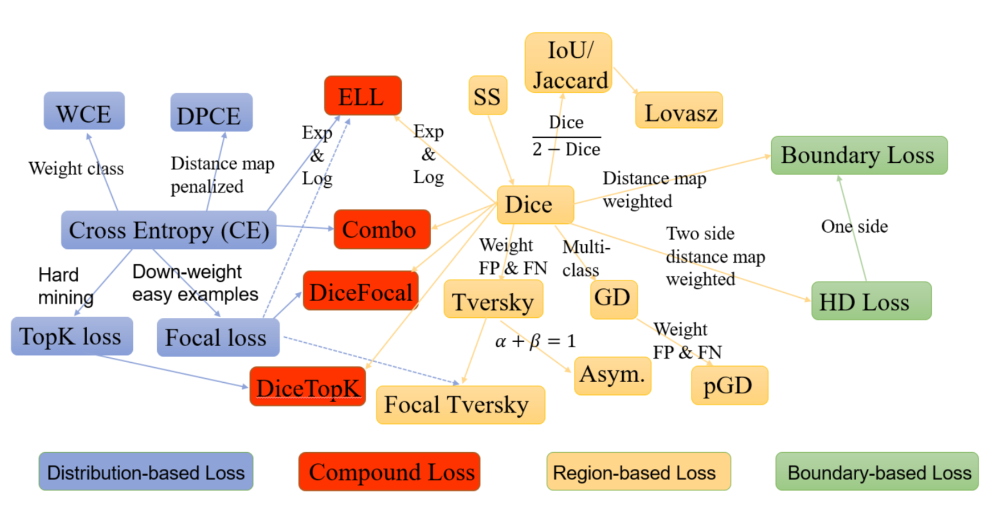
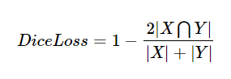
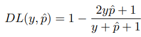
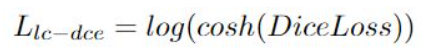
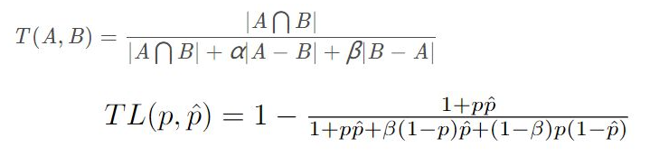
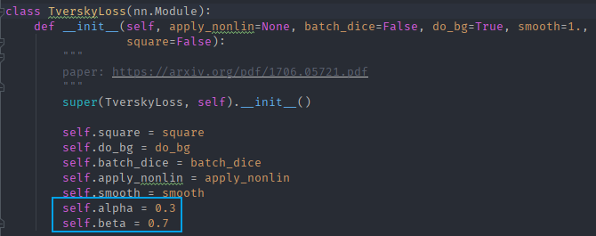
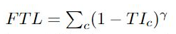

1.基于分布的损失函数，基于区域的损失函数，基于边界的损失函数和基于复合的损失函数（ Distribution-based,Region-based,  Boundary-based,  and  Compounded）
<!--more-->

2.分类标签不平衡问题：
	• 道路识别中，数据集拥有的正样本非常少，有时候背景负样本带来很多没必要的损失函数值的参数更新，类似噪声干扰了正样本训练，无论双分类训练还是多分类训练都存在该问题，更不用说多分类任务。
	• 解决方案
	损失函数本身对训练影响弱于数据集，但是，如果数据集中标签严重不平衡，还是应该选择二进制交叉熵(binary-cross entropy)之外的其他损失函数，如DiceLoss系列。
		○ 普通DiceLoss损失函数
        
        
		上面公式比较通俗，右侧部分称Dice系数（dice coefficient），由1减去就得到了DiceLoss。对于分割任务而言，绝对值X和Y分别代表ground_truth和predict_mask。一般和IoU一样作为测试的评价指数，实际训练效果非常糟糕。
		○ Log-Cosh Dice Loss
		普通DiceLoss由于其非凸性，它多次都无法获得最佳结果。Lovsz-softmax损失旨在通过添加使用Lovsz扩展的平滑来解决非凸损失函数的问题。同时，Log-Cosh方法已广泛用于基于回归的问题中，以平滑曲线。
        
		但是该损失函数无法在我的项目中运行（ExpLog_Dice）
		○ Tversky Loss
        
		Tversky系数是Dice系数和 Jaccard 系数的一种推广。当设置α=β=0.5，此时Tversky系数就是Dice系数。而当设置α=β=1时，此时Tversky系数就是Jaccard系数。α和β分别控制假阴性和假阳性。通过调整α和β，可以控制假阳性和假阴性之间的平衡。
        
		○ Focal Tversky Loss
        
		
参考文章： Loss Functions for Medical Image Segmentation: A Taxonomy | by JunMa | Medium https://medium.com/@junma11/loss-functions-for-medical-image-segmentation-a-taxonomy-cefa5292eec0#:~:text=Generalized%20Dice%20loss%20is%20the%20multi-class%20extension%20of,negatives%20and%20false%20positives%20in%20generalized%20Dice%20loss.
GitHub： GitHub - JunMa11/SegLoss: A collection of loss functions for medical image segmentation https://github.com/JunMa11/SegLoss
论文：https://arxiv.org/pdf/2006.14822.pdf

