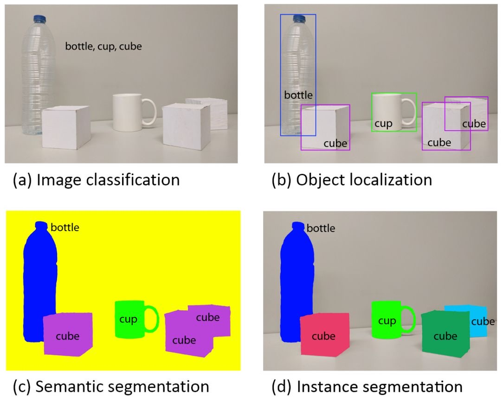
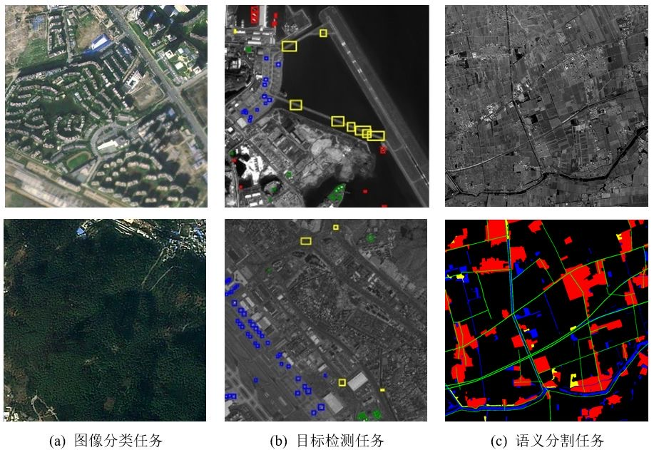
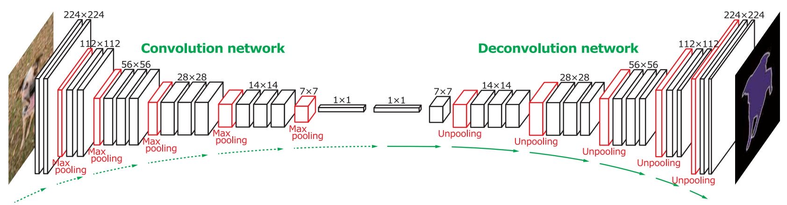
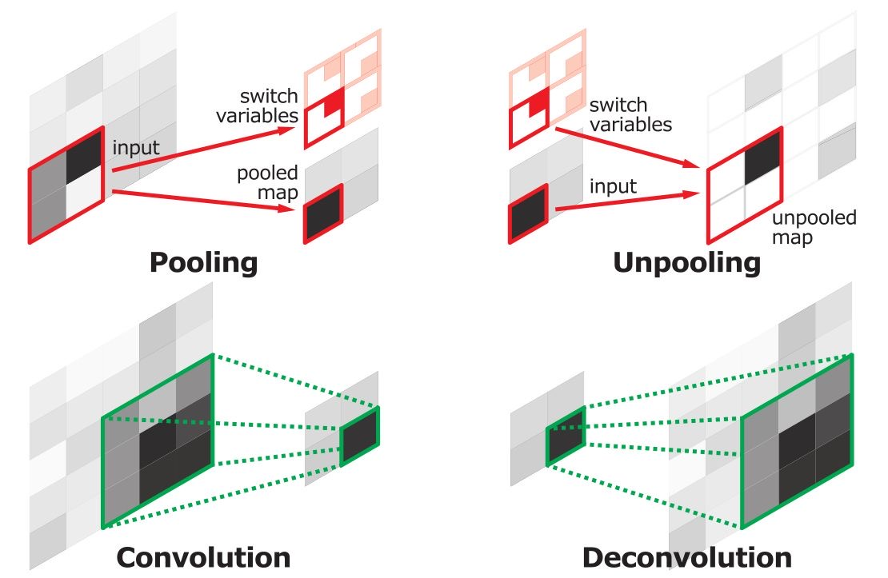
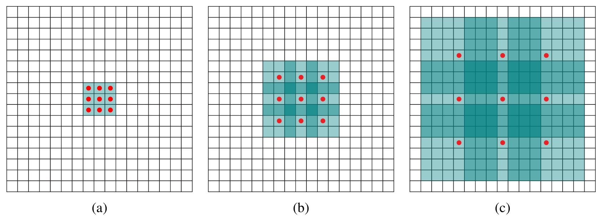
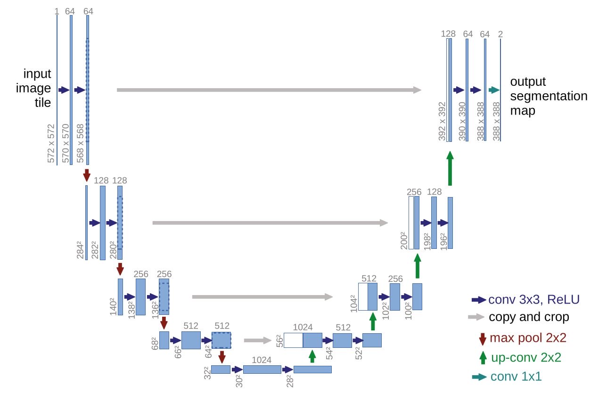

• 语义分割是计算机视觉的四大任务之一（四大任务：分类a、定位b、检测b、分割c+d），在语义分割中常用的公共数据集有PASCAL VOC 2012（1.5k train 1.5k validate 20types with background）、MS COCO（83k train 41k validate 80k test 80types）
<!--more-->

• 语义分割基本思路：
    ○ 基本思路：
    逐个像素分类。输入整张图片进入网络，输出大小和输入一致，通道数等于类别数，分别存放各个类别在某个像元位置的概率，即可逐个像素分类。
    ○ 全卷积网络+反卷积网络convolution and deconvolution network：
    为了使输出具有三维结构，全卷积网络中没有全连接层，只有卷积层和汇合层。但是随着卷积和汇合不断进行下去，图像的尺寸越来越小、通道数越来越多，就不能保证输出大小和输入一致，所以全卷积网络要使用反卷积和反汇合来增大空间大小。
    
    ○ 反卷积（或称转置卷积） deconvolution or transpose convolution：
    标准卷积的滤波器在输入的图像上滑动，每次和输入图像的局部区域点乘得到单个输出值，而反卷积的滤波器在输出图像上滑动，局部范围每个神经元值乘以滤波器对应值，得到一个输出的局部区域。标准卷积的后向过程和反卷积的前向过程完成的是同样的数学运算。而且同标准卷积滤波器一样，反卷积滤波器也是从数据中学到的。
    ○ 反最大汇合 max-unpooling：
    通常全卷积网络是对称的结构，在最大汇合时需要记录最大值所处的局部区域范围，在对应的反最大汇合时将对应位置的输出置为输入，其余位置补零。反最大汇合可以弥补最大汇合时的空间信息丢失。反最大汇合的前向过程和最大汇合的后向过程完成的是同样的数学运算。
    
• 语义分割常用技巧：
    ○ 膨胀\空洞\扩张卷积 dilated convolution：
    这是常用于分割任务以增大感受野的一个技巧。标准卷积操作中，每个输出神经元对应的局部区域的范围内是连续的。但是，扩张卷积向标准卷积运算中引入了一个新的超参数扩张量（dilation）用于描述输入局部区域在空间位置上的间距。（当扩张量为1时，扩张卷积退化回标准卷积）扩张卷积可以在参数量不变的情况下有效提高感受野，而与经典计算机视觉手工特征相比，大的感受野是深度学习方法能取得优异性能的重要原因之一。
    
    ○ 条件随机场 conditional random field(CRF)：
    这是一种概率图模型，常用于微调全卷积网络的输出结果，获得更好的细节信息。它的原理是更相近的像元更可能属于相同的类别。但是这样会要考虑两两像元之间的空间关系，会极大降低运行效率。
    ○ 利用低层信息：
    全卷积中，可以记录低层的信息，在对应的反卷积网络中的对应层采用加和（如FCN）或者沿通道方向拼接（如U-net）的方法弥补全卷积网络操作中丢失的细节和边缘信息，后者效果通常更好（如图）
    
		
（以上参考https://zhuanlan.zhihu.com/p/31727402）